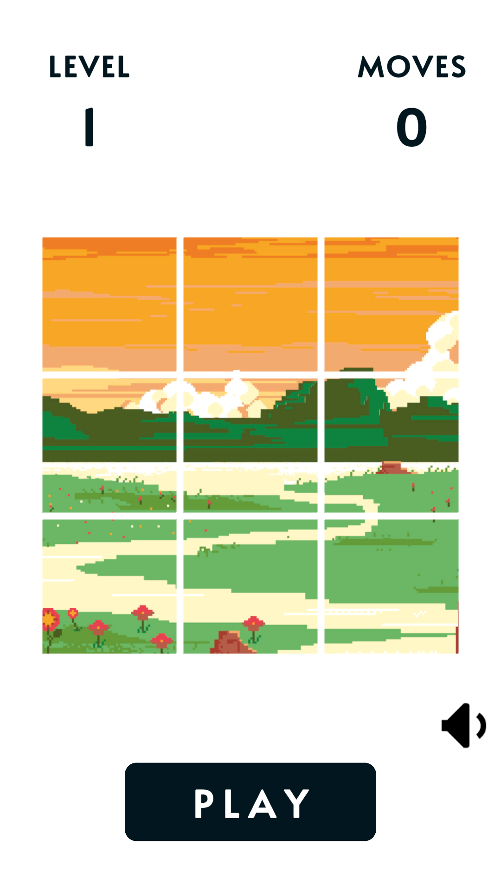
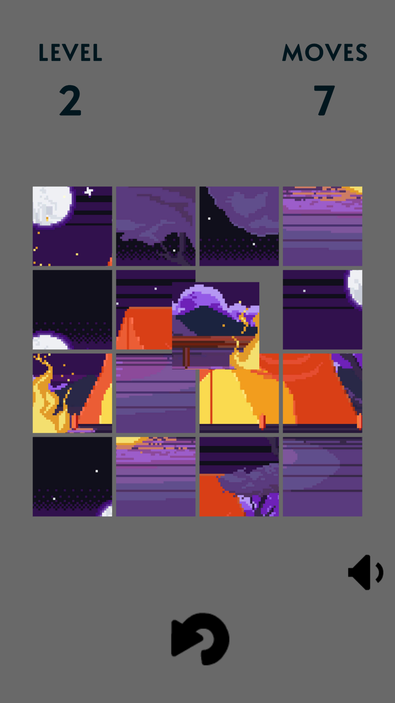

# Pixel Sort
Pixel Sort is a simple hyper-casual game where you piece together pixel art by sorting the correct tiles into place. Just tap and drag to move pieces, complete the image, and progress through levels!

Think you have the eye for it? Jump in and see how many pixel art puzzles you can solve! 🎨🧩

## Screenshots

  
  

## Download
- [:sparkles: Download from Itch.io](https://hieubigby.itch.io/pixel-sort)

## Credits
- [Original Project](https://github.com/zerefgd/ColorSort)
- Game Engine: [Unity](https://unity3d.com/)
- Thanks to all of the game development community for their awesome help.
